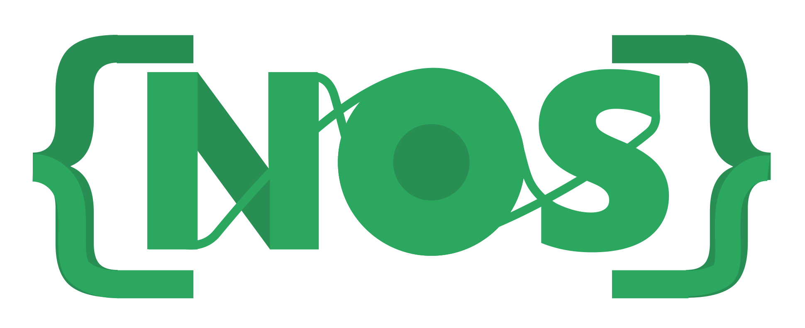

# Seja bem-vindo ao projecto {NOS}

{Nos} (Nós), é uma linguagem de programação escrita em javascript, baseada no Python e desenvolvida pela [LUK3D](http://www.luk3d.com).
O seu foco principal consiste em facilitar o processo de aprendizagem no ramo da programação. Ao invés de se usar um pseodocódigo (muito limitado), com o {Nos} você cria programas em seu idioma de preferência que podem ser compilados enquanto aprende a lógica de programação e os comandos da linguagem. A sua IDE permite ao programador escolher entre programação Visual (Diagramas de Fluxo) ou Escrita.

# NOS-IDE

Este é o repositório da IDE oficial da linguagem de programação NÓS. Caso queira contribuir esteja a vontade. Caso queria desenvolver com ela, siga os passo abaixo.

## REQUISITOS:

* Nodejs versão atual.

* Python Versão atual.

## Project setup
```
npm install
```

### Compiles and hot-reloads for development
```
npm run electron:serve
```

### Compiles and minifies for production
```
### npm run electron:build
```

### Lints and fixes files
```
npm run lint
```

### Veja mais em 
See [NOS](https://www.luk3d.com).
